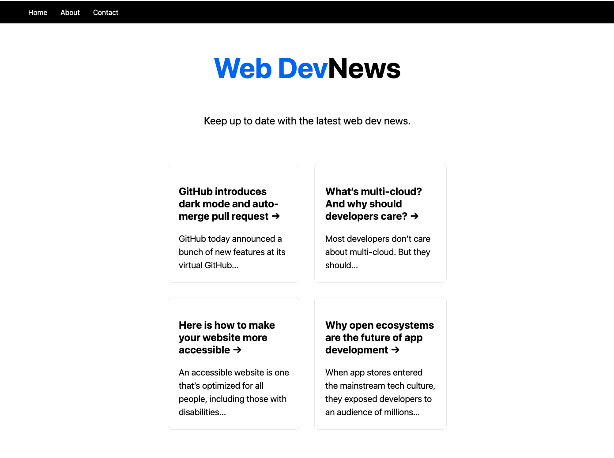
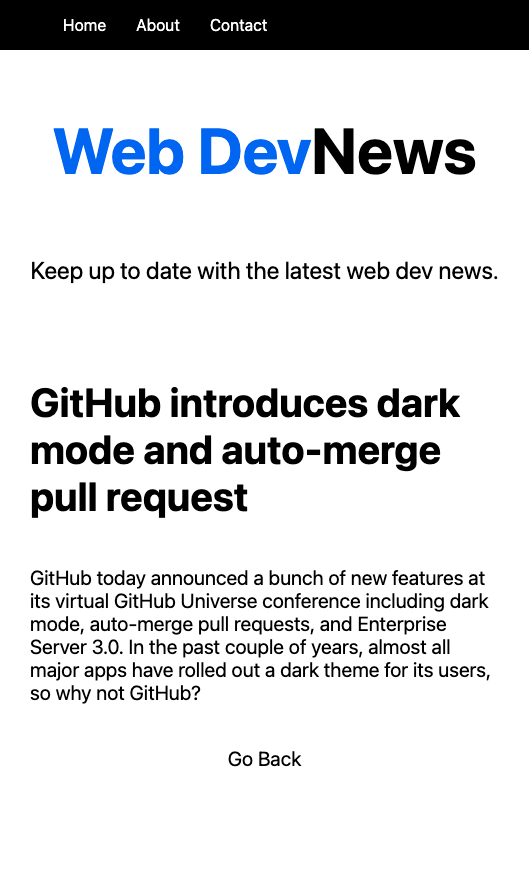

# Build a Next.js App

A simple Next.js app built based on this [Next.js crash course](https://www.youtube.com/watch?v=mTz0GXj8NN0).

## Getting Started

First, run the development server:

```bash
npm run dev
```

Open [http://localhost:3000](http://localhost:3000) with your browser to see the result.

You can start editing the page by modifying `pages/index.js` in your code editor. The page auto-updates as you edit the file.

<br>

## Key Features

- basic set-up (using npm)
- folder structure with `/components`, `/pages` (with `/api` and `/articles` subfolders), `/public`, `/styles`
- `Layout.js` file carries all the styles for all pages - the styles are in `Layout.module.css` (renamed from the default Home.module.css)
- the `Nav` component is styled individually (therefore placed outside of the main `<div>` in `Layout.js`)
- `_document.js` file to have access to the html (only rendered in the server)
- data fetching using `getStaticProps` and `getStaticPaths`
- nested routes (for individual articles, e.g. /article/1, /article/2 etc.)
- API routes for getting all articles and for getting a single article (see the following section)

<br>

## API Routes

[API routes](https://nextjs.org/docs/api-routes/introduction) can be accessed on [http://localhost:3000/api/articles](http://localhost:3000/api/articles) and on http://localhost:3000/api/articles/:id. These endpoints can be edited in `pages/api/articles/index.js` and `pages/api/articles/[id].js`.

The `pages/api` directory is mapped to `/api/*`. Files in this directory are treated as [API routes](https://nextjs.org/docs/api-routes/introduction) instead of React pages.

<br>

## Learn More

To learn more about Next.js, take a look at the following:

- [Next.js Documentation](https://nextjs.org/docs) - learn about Next.js features and API.

<br>

## Deploy on Vercel

The easiest way to deploy your Next.js app is to use the [Vercel Platform](https://vercel.com/new?utm_medium=default-template&filter=next.js&utm_source=create-next-app&utm_campaign=create-next-app-readme) from the creators of Next.js.

Check out our [Next.js deployment documentation](https://nextjs.org/docs/deployment) for more details.

<br>

## Screenshots

Homepage



Article detail


